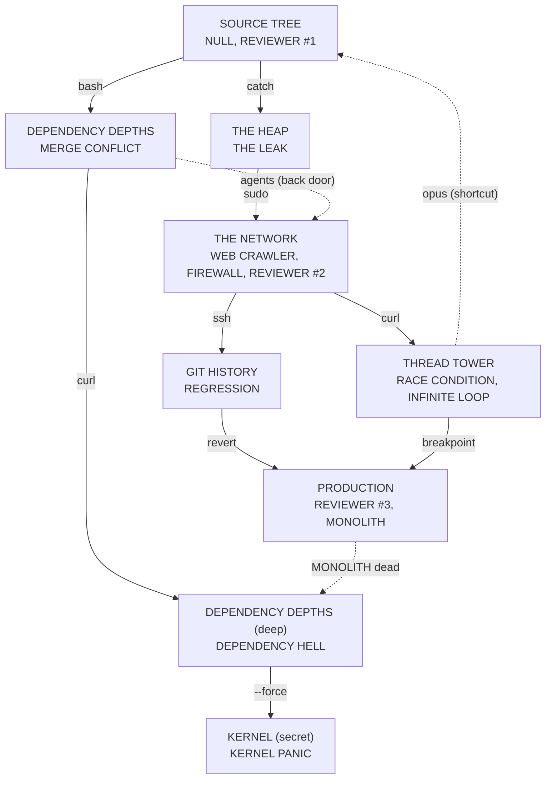

# MV0-05 · توانایی‌ها و درها

**نتیجه:** هر ۱۰ توانایی یه مانع مشخص داره (شکل، رفتار، اولین جای لازم). چهار سؤال باز بسته شد: THE REVIEWER #2 تو THE NETWORK، PRODUCTION با **هر کدوم** از دو در باز می‌شه، یه مسیر جایگزین از DEPENDENCY DEPTHS به THE NETWORK با `agents` اضافه شد، و `opus` فقط برای میان‌بر و رازها لازمه. جدول softlock حفره نداره.

ورودی‌ها: `00-decisions.md` §3–§4 و [`02-oss-bosses.md`](02-oss-bosses.md). عددهای پرش از ثابت‌های `js/player.js` در [`01-current-game.md`](01-current-game.md) حساب شدن.

## ۱. قانون‌های ثابت (برای جلوگیری از softlock)

| # | قانون |
|---|---|
| R1 | توانایی هر مانع، تو منطقه‌ای به دست میاد که برای ورودش به اون مانع نیازی نیست. |
| R2 | هر در یا مانع که با توانایی باز می‌شه، **برای همیشه باز می‌مونه** (دیوار شکسته می‌مونه، کلید فشرده می‌مونه). پس برگشت همیشه آزاده. |
| R3 | تنها مسیرهای یک‌طرفه: کف‌های `--force`، پل‌های فروریختنی `revert`، و درِ قفل‌شونده‌ی باس. هر کدوم یه راه برگشت داره که فقط توانایی‌های همون‌جا رو می‌خواد. |
| R4 | درِ باس فقط تا مرگ باس یا مرگ بازیکن قفله. مرگ = برگشت به آخرین checkpoint بیرون از اتاق. |
| R5 | کنار هر مانع `agents` یه «ایستگاه cache» هست که context meter رو پر می‌کنه، تا بدون توکن گیر نکنی. |

## ۲. جدول توانایی‌ها

«اولین جای لازم» جاییه که مسیر اصلی بدون اون بسته‌ست. «راز» یه اتاق اختیاری (پلاگین یا جون) تو منطقه‌ایه که **قبل** از گرفتن توانایی می‌بینیش و بعداً برمی‌گردی.

| توانایی | فعل | مانع | شکل و رفتار توی اتاق | اولین جای لازم | رازی که برمی‌گردی بازش کنی | دشمنی که یادش می‌ده |
|---|---|---|---|---|---|---|
| **bash** | dash ۸ جهته (`DASH_SPEED` ۳۲۰ × ۰.۱۵ ثانیه ≈ ۴۸ px) | دیوار ترک‌دار `%` | بلوک خاکستری با ترک نارنجی. با dash می‌شکنه و دیگه برنمی‌گرده. بعضی‌ها تا عمق ۳ بلوکه، یعنی dash دوم لازمه (dash با فرود پر می‌شه) | SOURCE TREE (در خروجی به DEPENDENCY DEPTHS) | تو SOURCE TREE یه اتاق پشت `%` که از همون اولین اتاق دیده می‌شه | FIREWALL GUARD (پشتش رو با dash بزن) |
| **catch** | پاری: ضربه‌ی دقیق به گلوله‌ی زرد، برمی‌گرده | کلید که فقط گلوله‌ی برگشتیِ زرد فشارش می‌ده | دکمه‌ی گرد با `{ }` روی دیوار. روبه‌روش یه توپخانه‌ی EXCEPTION (جعبه‌ی `try`) هر ~۲ ثانیه گلوله‌ی زرد می‌زنه. گلوله‌ی زرد = قابل برگردوندن (قانون رنگ). چند کلید با توپخانه‌های هم‌زمان: یکی‌یکی | SOURCE TREE (در THE HEAP) | یه کلید پشت شیشه تو SOURCE TREE که از همون اتاق‌های اول دیده می‌شه | EXCEPTION |
| **sudo** | پرش دوم (`DJUMP` ۲۷۲) | لبه‌ی بلند بدون دیوار برای دیوارپرش | پرش یکی ≈ `JUMP²/(2·G_UP)` = ۵۴ px (~۳.۴ کاشی)، با sudo ≈ ۹۹ px (~۶ کاشی). لبه‌ها ۴ تا ۵.۵ کاشی بالان و کنارشون دیوار صاف نیست. با علامت `sudo` روی تخته‌ی مشکی | THE HEAP → THE NETWORK (راهروی اتصال) | یه لبه‌ی بلند تو بالای SOURCE TREE | Drone (شناور بالای سرت، هدفش بالاست) |
| **agents** | meter پر می‌شه، دو کمکی ۱۱ ثانیه دنبال هدف می‌گردن | کلید تو شکاف | کلیدی تو شکاف یه کاشی‌ای تو دیوار، بازیکن جا نمی‌شه. وقتی کمکی‌ها میان، به هر «کلید شکاف» تو دید می‌زنن (۱۱ ثانیه). اتاق یه ایستگاه cache نزدیک ورودی داره (R5) | DEPENDENCY DEPTHS → THE NETWORK (در پشتی، اختیاری، مسیر جایگزین) | یه «انبار» تو SOURCE TREE که کلیدش تو شکافه | FORK و DDOS (کشتنشون meter رو پر می‌کنه) |
| **opus** | برد ۳۰ و آسیب ۲ (به‌جای ۲۴ و ۱) | کابل کلفت «اسپاگتی» | دسته‌کابل رنگی که ضربه‌ی آسیب ۱ ازش می‌پره (صدای «کلنگ») و فقط ضربه‌ی آسیب ۲ می‌بُرتش. بعضی کابل‌ها پشت فاصله‌ی ۲۸ px‌ن که با برد ۲۴ نمی‌رسه | میان‌بر THREAD TOWER → SOURCE TREE (روی مسیر اصلی لازم نیست) | کابل‌پیچ در SOURCE TREE، THE HEAP و THE NETWORK با پلاگین پشتش | BLOATWARE (HP زیاد، آسیب ۲ فرق رو حس می‌کنی) |
| **curl** | قلاب: به نقطه‌ی «endpoint» وصل می‌شی و می‌چرخی/می‌پری | نقطه‌ی لنگر روی شکاف یا چاه | حلقه‌ی آبی با برچسب `GET` تو سقف یا دیوار، بردش ~۶ کاشی (فاز ۱ تنظیم می‌شه). با دکمه‌ی special نزدیک‌ترین لنگر تو جهت هدف انتخاب می‌شه. پرتاب از قلاب آزاده | THE NETWORK → THREAD TOWER، و بخش عمیق DEPENDENCY DEPTHS | یه لنگر بالای THE HEAP که دیدنش از همون اولین اتاق راحته | SCRAPER (دشمن جدید: از لنگرِ شبیه endpoint آویزونه و پایین میاد؛ یادت می‌ده لنگرها چه شکلی‌ان) |
| **ssh** | تونل: رو به دیوار بمون ۰.۳ ثانیه تا رد بشی | دیوار نازک «firewall» | آجر قرمز با شعله و شماره‌ی پورت. فقط تا ضخامت ۲ کاشی (۳۲ px). ضخیم‌تر = نه با ssh | THE NETWORK → GIT HISTORY | یه گنج پشت دیوار نازک تو DEPENDENCY DEPTHS و THE HEAP (قابل دیدن از لای ترک) | WORM (تو دیوار حرکت می‌کنه؛ می‌بینی دیوار قابل‌عبوره) |
| **revert** | یه نشانگر بذار، بعداً برگرد بهش | کلید فشاری + پل فروریختنی | **نشانگر روی دکمه‌ی فشاری درِ رو باز نگه می‌داره** (فقط یه نشانگر). پل فروریختنی بعد از عبورت می‌ریزه؛ با نشانگر برمی‌گردی. در آخر GIT HISTORY ترکیب هر دو | GIT HISTORY → PRODUCTION | پل ریخته تو THE HEAP که تو ورود می‌بینی؛ دکمه‌ی فشاری تو SOURCE TREE | ZOMBIE PROCESS (دوباره بلند می‌شه، مثل `revert`) |
| **breakpoint** | یه دشمن یا پلتفرم متحرک رو ۳ تا ۴ ثانیه فریز کن (cooldown تو MV0-07) | پیستون و پنکه‌ی تایمی | پیستون‌های له‌کننده، پنکه‌هایی که پرتت می‌کنن، پلتفرم‌های متحرک رو سوراخ. فریز کنی می‌ایستن. دشمن فریزشده سطح محکمه (روی STACK OVERFLOW می‌ایستی) | THREAD TOWER → PRODUCTION | پلتفرم متحرک رو سوراخ تو DEPENDENCY DEPTHS و پیستون تو SOURCE TREE | SPYWARE (فریزش می‌کنی تا ببینیش)، STACK OVERFLOW |
| **--force** | ضربه‌ی رو به پایین تو هوا | کف قفل‌شده‌ی «package-lock» | کاشی‌ی رنگ سربی با قفل و زنجیر. فقط با ضربه‌ی پایین‌رو شروع‌شده از حداقل ۲ کاشی بالاتر می‌شکنه. کف‌هایی که می‌شکنی به اتاقی می‌ریزی که راه برگشت آزاد داره (R3) | KERNEL (راز نهایی) | یه کف قفل تو SOURCE TREE، THE HEAP و GIT HISTORY با پلاگین زیرش | DDOS (کف بسته‌ها رو با slam بشکن) |

## ۳. چهار سؤال باز

| سؤال | جواب | دلیل |
|---|---|---|
| THE REVIEWER #2 کجا؟ | **THE NETWORK**، تو اتاق مرکزی، درِ خروجی رو بسته نگه می‌داره. دری که به THREAD TOWER و GIT HISTORY می‌ره بعد از **مرگ هر دو باس** WEB CRAWLER و FIREWALL و شکست REVIEWER #2 باز می‌شه | بعد از curl و ssh، پارِی `catch` رو می‌شناسی؛ REVIEWER هر چی یاد گرفتی رو تست می‌کنه (دفعه‌ی دوم، تندتر). هر دو توانایی رو دست داریم، پس بعدش ورودی TOWER و GIT بدون «اگه فلانی رو نداشتی» باز می‌شه |
| PRODUCTION یه در یا هر دو؟ | **هر کدوم کافیه** (revert از GIT یا breakpoint از TOWER). برای ۱۰۰٪ هر دو در یه راز دارن | ترتیب آزاد، بدون اینکه یکی اجباری بشه. بازیکن Co-op هر کدوم رو دوست داشت |
| مسیر جایگزین | از DEPENDENCY DEPTHS یه **در پشتی به THE NETWORK** با `agents` (کلید تو شکاف). یعنی بعد از SOURCE TREE دو مسیر کاملاً مستقل هست: HEAP→NETWORK (sudo) یا DEPTHS→NETWORK (agents). اتاق‌های اجباری داخل THE NETWORK فقط bash و catch می‌خوان، پس هر دو مسیر ورودی سالم‌ان | حالا ترتیب ثابت نیست. اگه HEAP رو رد کنی، sudo رو نداری و تو THREAD TOWER (چاه‌های بلند) یا PRODUCTION برمی‌گردی HEAP (برگشت آزاده، R2) |
| محیط‌استفاده‌ی agents و opus | agents = کلید تو شکاف (بالا، جدول). opus = کابل کلفت (بالا). هیچ‌کدوم روی مسیر اصلی لازم نیست جز در پشتی (agents)، پس یه بازیکن بدون اون‌ها هم می‌تونه بازی رو تموم کنه | این دو تا «ارتقا»ن، نه کلید. Hollow Knight هم ارتقاهای میخ رو برای مسیر اجباری نمی‌خواد |

## ۴. بررسی softlock

«با چی وارد می‌شی» = حداقل چیزی که قطعاً داری. «لازم داخلش» = مانع‌های مسیر اصلی اون منطقه (به جز رازها).

| منطقه | با چی وارد می‌شی | لازم داخلش | می‌تونی بیای بیرون؟ | حفره؟ |
|---|---|---|---|---|
| SOURCE TREE | هیچی | بعد از NULL: bash. بعد از REVIEWER #1: catch | بله، شروع بازیه، هر در بعد از شکستن/فشردن باز می‌مونه (R2) | نه |
| DEPENDENCY DEPTHS | bash + catch (هر دو از SOURCE TREE) | bash، catch. بخش عمیق: curl (بعداً) | بله، دیوار شکسته‌ی ورودی باز می‌مونه | نه |
| THE HEAP | bash + catch | bash، catch | بله، کلید فشرده می‌مونه | نه |
| THE NETWORK | از HEAP: bash، catch، sudo. از DEPTHS: bash، catch، agents | bash، catch. (sudo یا agents فقط تو راه ورودی) | بله، هر دو در ورودی دو طرفه‌ان | نه (R2) |
| THREAD TOWER | bash، catch، curl، ssh (هر دو باس NETWORK مرده) | curl، sudo (اگه HEAP رو رد کرده باشی نداری → برگرد HEAP؛ برگشت آزاده) | بله | نه، فقط backtracking |
| GIT HISTORY | bash، catch، curl، ssh | ssh، bash، catch | بله. پل‌های فروریختنی همیشه یه نشانگر خودکار تو ابتدای پل می‌ذارن (R3) | نه |
| PRODUCTION | از GIT: revert + همه‌ی بالا. از TOWER: breakpoint + همه‌ی بالا | bash، catch، sudo، curl | بله، هر دو در دوطرفه، دوباره باز می‌شن | نه، sudo مثل TOWER (برگشت آزاد) |
| KERNEL (راز) | MONOLITH مرده + --force | --force، bash، catch، sudo، curl | بله (کف‌های شکسته راه برگشت دارن) | نه |

**ترتیب‌های ممکن:** بعد از SOURCE TREE: DEPTHS اول یا HEAP اول. بعد از NETWORK: TOWER اول یا GIT اول. این یعنی ۲ × ۲ ترتیب، و یه «برو DEPTHS و از در پشتی وارد NETWORK شو» که HEAP رو دور می‌زنه.

## ۵. نقشه

خط‌چین = مسیر اختیاری یا میان‌بر. نکته: «DEPTHS (deep) → KERNEL» وقتی باز می‌شه که MONOLITH مرده باشه.

## ۶. تصمیم‌هایی که Zakaria باید تأیید کنه

1. در پشتی DEPTHS → NETWORK با `agents` (جایگزین مسیر ثابت).
2. PRODUCTION با هر یکی از دو در باز می‌شه.
3. `opus` و `agents` ارتقان، نه کلید اجباری (جز در پشتی).
4. REVIEWER #2 درِ THE NETWORK رو می‌بنده تا هر دو باس (WEB CRAWLER و FIREWALL) مرده باشن.
5. دشمن جدید SCRAPER (برای curl) به فهرست ۱۲ تایی اضافه می‌شه.
