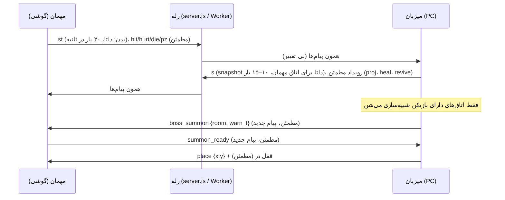

# MV0-06 · Co-op با دوربین جدا

**نتیجه:** مدل مالکیت فعلی می‌مونه (میزبان صاحب دنیا، مهمان صاحب بدنش). میزبان فقط اتاق‌هایی رو شبیه‌سازی می‌کنه که کسی توشونه. مهمان فقط اتاق خودش رو می‌گیره، پس پهنای باند دو برابر نمی‌شه. برای انتقال، پیشنهادم اینه که **اول از WebSocket روی همین `server.js` شروع کنیم** و WebRTC رو بعد از اندازه‌گیری اضافه کنیم؛ این با پیشنهاد `00-decisions.md` فرق داره و Zakaria باید تأیید کنه (سطر ۷).

منابع: `CLAUDE.md`، [`docs/PROTOCOL.md`](../PROTOCOL.md)، [`docs/reports/phase1.md`](../reports/phase1.md) تا [`phase3.md`](../reports/phase3.md)، `00-decisions.md` §8، `01-current-game.md` §8. هر چیزی که درباره‌ی Godot نوشتم «از حافظه»ست، مگه اینکه کنارش لینک باشه؛ توی فاز ۲ باید با Godot 4.7.2 تست بشه.

## ۱. جدول تصمیم‌ها

| # | سؤال | تصمیم | دلیل | چی نظرم رو عوض می‌کنه |
|---|---|---|---|---|
| ۱ | مالکیت | همون مدل فعلی: **میزبان** صاحب دنیاست (دشمن، آیتم، کاشی، اتاق‌ها، باس). **مهمان** صاحب بدن خودش (حرکت، جون، تله‌ها) و ضربه‌هاش رو با رویداد مطمئن `hit` اعلام می‌کنه؛ میزبان با یه ثانیه تاریخچه‌ی hurtbox (`recordHist`) چک می‌کنه. تو Godot: هر Player یه `owner_peer` داره (نقشه‌ی `set_multiplayer_authority` از حافظه)؛ بقیه‌ی نودها دست میزبانه | همین مدل ۳ فاز باگ‌گیری رو رد کرده و با گوشی ضعیف جوره: مهمان فقط خودش رو شبیه‌سازی می‌کنه | اگه تو فاز ۲ تأخیر ضربه (hit-feel) روی Godot بدتر از وب فعلی بود، پیش‌بینی ضربه‌ی مهمان رو بیشتر می‌کنیم |
| ۲ | دو اتاق هم‌زمان | فقط **اتاق‌های دارای بازیکن** شبیه‌سازی می‌شن (حداکثر ۲). اتاق همسایه رو پیش‌بارگذاری می‌کنیم ولی نگه می‌داریم (بدون فیزیک) تا لحظه‌ی عبور. اتاقی که هر دو ازش رفتن **فریز می‌شه** و وقتی برگشتن مثل Hollow Knight ریست می‌شه: دشمن‌های معمولی و گلوله‌ها دوباره می‌سازن؛ چیزهای ثابت می‌مونن (باس مرده، آیتم برداشته‌شده، دیوار شکسته، کلید فشرده، در باز) | CPU میزبان (PC) برای ۲ اتاق کافیه؛ نگه داشتن اتاق‌های بی‌کس هیچ فایده‌ای نداره و فقط خطا می‌سازه. هر اتاق تو `SubViewport` با `own_world_2d` جدا می‌شه که فیزیک‌ها قاطی نشن (از حافظه، فاز ۲ تست) | اگه حس بدی داشت که دشمن‌ها با رفتن شما ریست می‌شن، فقط اتاق «نزدیک» رو نگه می‌داریم |
| ۳ | تله‌پورت اتاق باس | **تریگر:** اولین بازیکنی که از «خط ورود» اتاق باس رد بشه. ۱) بازیکن دوم یه بنر با شمارش ۳ ثانیه‌ای می‌بینه («Partner fights NAME, joining in 3…»)، ۲) بدنش بی‌آسیب و بی‌حرکت می‌شه و تو یه محو شدن می‌ره، ۳) تو «جایگاه مهمان» اتاق ظاهر می‌شه (۱.۵ ثانیه بی‌آسیبی). **وسط پرش:** منتظر فرود می‌مونه، حداکثر ۱ ثانیه، بعد با سرعت صفر می‌ره. **وسط cutscene:** تا پایان cutscene منتظر می‌مونه (قابل رد کردن)، ولی معرفی باس برای نفر اول بیشتر از ۵ ثانیه معطل نمی‌شه؛ بعداً از «پورتال احضار» وارد می‌شه، نه از در. **افتاده (downed):** همون بدن افتاده با تایمر احیا منتقل می‌شه. **در:** وقتی دومی رسید (یا ۵ ثانیه گذشت) پشت هر دو قفل می‌شه. تا باس زنده‌ست هیچ‌کس از اتاق بیرون نمی‌ره | قانون «نفر دوم هیچ‌وقت بیرون از اتاق باس نمی‌مونه و تو cutscene حاضره» از Bleed 2 (`00-decisions.md` §8) | اگه فاز ۲ نشون داد ۳ ثانیه کمه (گوشی لود کنه)، اون رو بلندتر می‌کنیم؛ زمان‌ها قابل تنظیمن |
| ۴ | احیا وقتی دور هستید | **اگه اون یکی زنده و تو همون اتاق:** همون ۶ ثانیه (`REVIVE_T`)، کنار شریک. **اگه دور هست:** بعد از ۶ ثانیه بازیکن تو آخرین نقطه‌ی امن همون اتاق (ورودی‌ش) با جون کامل برمی‌گرده؛ نه کنار شریک. **اگه هر دو افتادن:** هر کدوم تو آخرین checkpoint (نیمکت) خودش با جون کامل؛ باس‌ها ریست. تو اتاق باس: مثل الان کنار شریک؛ هر دو افتادن = هر دو ورودی اتاق | الان «ریستارت مرحله» داریم ولی تو نقشه‌ی پیوسته مرحله‌ای نیست. خودکار کنار شریک بردن وقتی دوره، شریک رو وسط دعوا می‌ندازه | اگه فاز ۲ نشون داد بازیکن‌ها گم می‌شن، گزینه‌ی «برو پیش شریک» به منو اضافه می‌شه |
| ۵ | مشترک یا جدا | **مشترک:** توانایی‌ها (اگه یکی bash رو گرفت هر دو دارن)، نقشه‌ی کشف‌شده (اجتماع)، در و کلید و کلیدهای فشرده، پلاگین‌های پیداشده (فهرست مشترک). **جدا:** توکن‌ها (کیف هر نفر؛ جایزه‌ی باس به هر دو)، پلاگین‌های سوار‌شده (هر نفر چیدمان خودش)، جون، تنظیمات و کلیدها | اگه توانایی مشترک نباشه مهمان تو اتاق‌های bash/curl گیر می‌کنه و راه نفر اول رو نمی‌تونه برسه. توکن جدا شد تا نبرد برسر آیتم نباشه | اگه دوستش بخواد «مال خودمه» حس کنه، پلاگین‌ها هم جدا می‌شن |
| ۵b | ذخیره | **میزبان** فایل ذخیره‌ی دنیا رو نگه می‌داره (flagهای دنیا، توانایی‌ها، نقشه، باس‌های مرده، checkpoint هر بازیکن). **مهمان** فقط پروفایل خودش رو رو دستگاهش نگه می‌داره (چیدمان پلاگین، کیف توکن، تنظیمات). وقتی مهمان خودش میزبان بشه از دنیای خودش شروع می‌کنه؛ هیچ توانایی‌ای از دنیای دوستش با خودش نمی‌بره | ساده و بی‌تعارض. مهمان نمی‌تونه ذخیره‌ی دنیا رو خراب کنه | اگه می‌خوای مهمان هم پیشرفتش رو ببره، یه «پاداش مهمان» جدا اضافه می‌شه (فاز بعد) |
| ۶ | ورود و خروج | **ورود تو بازی:** کد ۶ رقمی مثل الان. مهمان حالت کامل دنیا (keyframe) رو می‌گیره و کنار میزبان ظاهر می‌شه. اگه میزبان تو باسه، مهمان با قانون ۳ (احضار) وارد اتاق می‌شه؛ **HP باس تغییر نمی‌کنه.** **خروج:** تا ۱۵ ثانیه نگه‌داشتن صندلی (`token`)، بدن ghost (بی‌آسیب و هدف‌ناپذیر). **قطع میزبان:** مهمان به صفحه‌ی «میزبان رفت» می‌ره و پروفایلش ذخیره می‌مونه (مثل الان: صفحه‌ی انتظار/نقشه) | همه از رفتار فعلی و باگ‌های فاز ۱/۳ میان | اگه میزبان رو دوست زیاد قطع کرد، فاز بعد «انتقال میزبان» رو بررسی می‌کنیم؛ الان نه |
| ۷ | انتقال | **لایه‌ی `Transport` با یه رابط ساده** (`send(bytes, reliable)` و `on_message`). **فاز ۲ با WebSocket**: هر دو مرورگر به همین `server.js`/Worker وصل می‌شن و پروتکل فعلی (پاکت `e`/`n`/`ra`، رویدادهای مطمئن، دلتا) رو با پیام‌های **جدید** گسترش می‌دیم. **WebRTC** (`WebRTCMultiplayerPeer`) به‌عنوان سازنده‌ی دوم **بعد از تست** اضافه می‌شه | ۱) مرورگر نمی‌تونه سرور WebSocket باز کنه، پس رله لازمه؛ ۲) راه فعلی Zakaria (پورت ۳۰۰۰ TCP از مودم) فقط TCP هست و کوتاه‌ترین ping رو داره؛ WebRTC به UDP و STUN/TURN وابسته‌ست و پشت CGNAT موبایل ممکنه وصل نشه (از حافظه)؛ ۳) لایه‌ی خودمون (مطمئن/ack/دلتا) رو دوباره‌نمی‌نویسیم، تستش ۶۰ سناریو داره. **رله‌ی فعلی همچنان باید برای بازی فعلی کار کنه:** فقط نوع پیام جدید اضافه می‌شه، و فقط از فاز ۱ به بعد | اگه تست فاز ۲ نشون بده تأخیر WebSocket (TCP head-of-line) روی گوشی غیرقابل‌تحمله و WebRTC وصل می‌شه، WebRTC پیش‌فرض می‌شه (تصمیم Zakaria) |
| ۸ | درس‌ها | جدول بخش ۲ | | |
| ۹ | تست | بخش ۴ | | |

## ۲. نمودار: کی چی می‌فرسته

## ۳. درس‌هایی که نگه داشتیم

هر خطا از گزارش‌های فاز ۱ تا ۳ و `CLAUDE.md` آورده شده و اینکه طرح جدید چطور از اولش ازش دوری می‌کنه.

| خطای قبلی | چطور تو طرح جدید نمی‌افته |
|---|---|
| فیلد `i`/`k` رویداد با شماره‌ی کانال برخورد کرد و کل کانال قفل شد | هر رویداد یه پاکت `{id, kind, d:{…}}` داره؛ داده فقط تو `d` می‌رود و هیچ‌وقت کنار `id`/`kind` نیست. یه تست هر کلید `d` رو با `id`/`kind` مقایسه می‌کنه |
| یه ضربه‌ی دو نفر دو بار حساب شد (`double-hit`، ۱۴ به‌جای ۲) | هر ضربه `(player_id, attack_seq)` داره و هر دشمن آخرین `attack_seq` هر بازیکن رو یادش می‌مونه |
| قطع شدن شریک وقتی بازیکن افتاده بود، بازی رو قفل کرد (`softlock`) | قطع شدن شریک، صف احیا رو خالی می‌کنه و فوراً زنده می‌کنه (قانون ۴) |
| معرفی باس برای مهمان فریز نبود (`boss-intro`) | شماره‌ی «epoch» هر **اتاق** هست، نه مرحله؛ هر پیام اتاق + epoch داره و معرفی باس بخشی از احضار (قانون ۳) |
| تب پنهان‌شده شبیه‌سازی رو خراب کرد | `away` + بدن ghost بی‌آسیب (گوشی اندروید تب‌ها رو مرتب می‌بنده) |
| pause: snapshot قدیمی حالت pause رو برگردوند، منو خودش بسته می‌شد (`pause-resume`) | `hs` با ساعت میزبان؛ snapshot قدیمی‌تر از اون حالت pause رو عوض نمی‌کنه. شبیه‌سازی محلی مهمان وقتی میزبان pause کرده می‌ایسته |
| مهمان هر پرش هوایی رو «دیوار شکسته» اعلام کرد (`bt-spam`، ۳۴ پیام) | فقط میزبان تغییر دنیا (دیوار، کلید، در) رو تصمیم می‌گیره؛ مهمان فقط جلوه‌ی محلی نشون می‌ده |
| لرزش و فلاش صفحه‌ی طرف مقابل هم روی صفحه‌ی من اجرا می‌شد | هر جلوه علت‌ش (`p1`/`p2`/`all`) رو داره؛ shake و hitstop فقط برای کسی که زده |
| دوست وسط مرحله وصل می‌شد و مرحله ریستارت می‌شد (`late-join`) | حالت کامل دنیا (keyframe) در لحظه‌ی ورود |
| حلقه‌ی snapshot ۳۲ تایی کوچیک بود و همه چیز keyframe شد | حلقه ≥ ۹۶ و حساب تأخیر ack؛ تست با خط بد |
| بررسی ضربه، تأخیر خط رو حساب نمی‌کرد | hurtbox یه ثانیه تاریخچه + ۰.۴ ثانیه بی‌آسیبی اضافه روی خط کند |
| خط نیمه‌مرده (بدون بسته شدن) بی‌صدا ماند (`half-open`) | heartbeat هر ۲ ثانیه؛ ۳ پاسخ از دست رفته = مرده؛ مهمان بعد از ۶ ثانیه سکوت reconnect می‌کنه |
| دشمنی که مهمان کشته بود هنوز آسیب می‌زد (`zombie`) | وقتی ضربه‌ی مهمان روی صفحه‌ش کشت، دشمن تا ۱ ثانیه برای اون بی‌آسیب می‌شه |
| bufferbloat: صف بزرگ، ping بالا | ارسال وقتی بافر > ۴ KB رد می‌شه؛ رله پیام‌های `u:1` رو می‌ریزه |

## ۴. چیزهایی که فقط تست واقعی فاز ۲ حل می‌کنه

هر کدوم با روش و معیار قبول.

| # | چی | چطور تست می‌شه | معیار |
|---|---|---|---|
| T1 | هزینه‌ی دو اتاق هم‌زمان رو CPU میزبان | دو اتاق با ۲۰ دشمن + باس، پروفایل ۱۰ دقیقه‌ای روی PC خود Zakaria | میانگین فریم ≥ ۵۵ fps در PC (عدد من تخمینه) |
| T2 | حافظه و فریم روی گوشی (مهمان) وقتی تو اتاق باس‌ه | ۱۰ دقیقه بازی با پروتکل `06-phase1-test.md` | بدون رشد حافظه، ۳۰ fps ثابت |
| T3 | پایداری `own_world_2d` برای دو اتاق (فیزیک جدا) | تست خودکار: هر دو بازیکن تو اتاق‌های جدا، بعد ورود هم‌زمان | بدون پرش یا فیزیک مشترک |
| T4 | لحظه‌ی تله‌پورت و ۳ ثانیه‌ی هشدار | ۴ حالت (هوا، cutscene، افتاده، قطع) با هر دو بازیکن واقعی | بازی‌کن می‌گه «ناگهانی نبود»، هیچ‌کس بیرون نمی‌مونه |
| T5 | احیای دور از شریک (قانون ۴) | تست حس با Zakaria و دوستش | کسی گم نشه؛ اگه شد گزینه‌ی «برو پیش شریک» |
| T6 | تأخیر WebSocket با WebRTC (قانون ۷) | همون ۶۰ سناریوی فعلی با `SIM_*` و بعد روی خط واقعی | ping میانه < ۱۵۰ ms روی TCP، یا WebRTC بهتره |
| T7 | وصل شدن WebRTC از شبکه‌ی گوشی (CGNAT) | تست واقعی با `WebRTCMultiplayerPeer` | در ≥ ۹۰٪ تلاش‌ها بدون TURN وصل می‌شه، وگرنه TURN لازمه |
| T8 | ورود وسط باس | مهمان تو لحظه‌ی فاز ۲ باس وارد بشه | بدون خطا، HP باس درست |
| T9 | حجم دانلود و لود اول (صفحه‌ی وب) | با گوشی، اولین بار و بار دوم | در `06-phase1-test.md` |

**تخمین پهنای باند** (از گزارش فاز ۳، اعداد قبلی نه اندازه‌گیری جدید): میزبان→مهمان ~۱–۴ KB/s و مهمان→میزبان ~۲ KB/s برای یه اتاق. چون مهمان فقط اتاق خودش رو می‌گیره، دو اتاق این عدد رو دو برابر نمی‌کنه. بار اضافه‌ی دو اتاق روی CPU میزبانه (T1).

## ۵. تصمیم‌هایی که Zakaria باید تأیید کنه

1. شروع با WebSocket و WebRTC بعداً (به‌جای WebRTC از اول).
2. توانایی‌ها و نقشه مشترکن؛ توکن‌ها و چیدمان پلاگین جدا.
3. احیای دور از شریک: برگشت تو آخرین نقطه‌ی امن همون اتاق، نه کنار شریک؛ هر دو افتادن = checkpoint هر کدوم.
4. ۳ ثانیه هشدار قبل از تله‌پورت اتاق باس.
